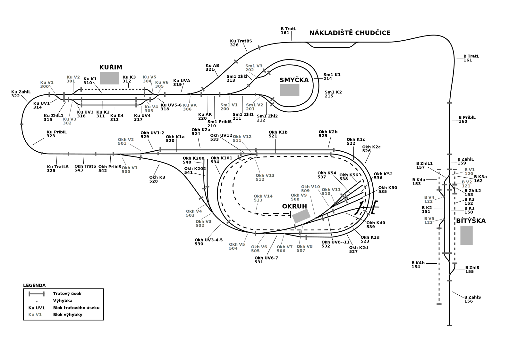

# rkd-topology

This repository contains helpful functions to support topology and find paths
 between different parts of this topology.



## Introduction

To find a path from A block to B block we build a graph. Nodes of this graph contains blocks of three types:
 - usek;
 - tratUsek;
 - vyhybka.

We manipulate 2 files - kolejiste.svg and vztahy.json.

kolejiste.svg is a SVG-visualization of all presented sections for now. From 
kolejiste.svg we can get vztahy.json which is a special file to have 
relationships between all sections. It has the next structure:

```json
{
    "relations": {
        "1": [
            "2",
            "3"
        ]
    },
    "data": {
        "1": {
            "type": "usek"
        },
        "3": {
            "type": "tratUsek"
        },
        "2": {
            "type": "vyhybka",
            "relations": {
                "3": "start",
                "4": "S+",
                "5": "S-"
            }
        }
    }
}
```

"relations" key contains section-neighbors to build a graph, "data" - details
about every section. For now, blocks with type "vyhybka" have "relations" 
part, where placed nodes of three types:
- start (input block)
- S+ (direct)
- S- (branch)

kolejiste.svg has the same data as vztahy.json, but stores it in another way.
Every section has text label and information about it are placed as 
attributes of this label tspan tag. Every such tspan element (by design) 
must have the next structure:
 
```xml
<tspan additional-data="{'relations': {'315': 'start', '311': 'S+', '316': 
'S-'}}" id="..." relations="[315, 316, 311]" style="..." type="vyhybka"
x="..." y="...">302</tspan>    
```

## Scripts

### Convert data between kolejiste.svg and vztahy.json 
 
You need to use `topology_converter.py` in the next cases:
 - generate vztahy.json from kolejiste.svg;
 - update kolejiste.svg from vztahy.json, where you did some updates.
 
 ```text
$ python topology_converter.py --help

usage: topology_converter.py [-h] [--to-json] [--to-svg]

It's a script to convert data between topology file and relations file.

optional arguments:
  -h, --help  show this help message and exit
  --to-json   Extract data from SVG file to JSON
  --to-svg    Extract data from JSON file to SVG
```

### Find path from section A to section B

To do it you need to use topology.py:

```text
$ python topology.py --help

usage: topology.py [-h] --start START --end END

Find path between start and stop sections. This script will print list of
sections IDs and list of switch sections IDs with their states ("S+" state
means direct direction, "S-" is a branch). E.g. ["1", "2", "3"], [("4", "S+"),
("5", "S-")

optional arguments:
  -h, --help     show this help message and exit
  --start START  Start path section
  --end END      End path section

```
